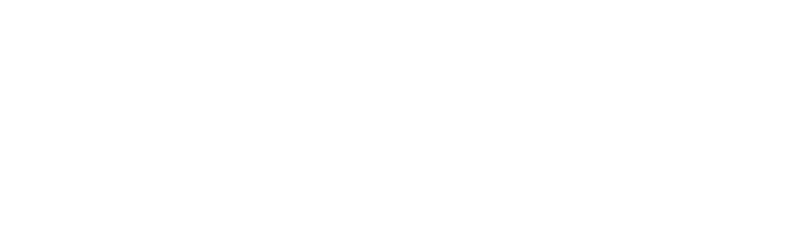

A very short 1-bit-fast-paced-platformer set in a frozen, ancient dungeon made entirely from scratch with low-level raylib and c++ Code with own custom library's and tools.

 - [Itch.io site](https://ll-program.itch.io/frozencore)
## Build the Game
 To build the game on windows, VS Community Edition 2022 or newer and raylib is required.

 To build it run ```./build.bat```
## The FCL file format (FrozenCoreLevel Format)
This file format was custom made with its own level editor in ```Tools/leveleditor.py```, to quickly load levels and load them into the custom Engine.
## Patch 1.1.0 Changes:

 - Temperature Tutorial updatet
 - Controller Snow Storm Bug patched
 - Shift Icon Updatet
 - Music Volume set lower
 - Faster Chest Animation
 - Kill Screen updatet
 - Controller Icon X doesnt show up patched
 - Credits Retry bug patched
## Credits

 - Programming by Lukas Rennhofer, Moritz Rottensteiner
 - Art by Moritz Rottensteiner, Lukas Rennhofer
 - Music by Timothy Kulig :  [Website](https://timkulig.com)
 - Inspired by Celeste


